<!--
  GitHub profile README for kiankhooban
  Lives in the repo named exactly "kiankhooban" (must be PUBLIC to display).
  Theme: green self-healing cutting mat (workbench/precision aesthetic).
  Accents: mat green (#7BC796) and marking yellow (#E9D27E) on GitHub dark.
  Hero: assets/hero.svg, a self-hosted animated SVG (Archivo Expanded, the
  open-source twin of Monument Extended, subset and embedded as base64).
  It paints its own mat background so it renders identically on light and
  dark GitHub; do not split it into theme variants via <picture>, that
  trick follows the OS theme, not the GitHub theme, and goes invisible on
  mismatch. No entrance animations: Chromium can freeze SVG-as-image at
  frame one, so t=0 must be the complete hero.
-->

---

I am a fourth-year Computer Science student at York University (Lassonde School of Engineering). I work at two layers of the stack: **deep learning for medical imaging**, and **compute-in-memory and computer arithmetic**. The thread between them is a design taste I keep returning to: put the hard, verifiable guarantee in the core and reserve the intelligence for the edge, where it earns its cost.

I am building toward the intersection of technology and research.

 

### Featured work

<table>
<tr>
<td width="50%" valign="top">

**[Expiry](https://github.com/kiankhooban/expiry)** &nbsp;·&nbsp; [live](https://expiry-gamma.vercel.app)

A medical reversal radar that flags treatments whose evidence has already been overturned by an updated guideline. A deterministic rules engine does the safety-critical flagging with zero LLM cost; Microsoft Foundry IQ supplies on-demand, citation-grounded explanations.

`Next.js` `TypeScript` `Foundry IQ`

</td>
<td width="50%" valign="top">

**[LinkedIn](https://linkedin.com/in/kiankhooban)**

Connect on LinkedIn for research collaborations, ML engineering conversations, or hardware-adjacent opportunities.

`linkedin.com/in/kiankhooban`

</td>
</tr>
</table>

 

### Toolbox

  

Also: RISC-V &nbsp;·&nbsp; SystemVerilog / Verilog (RTL design) &nbsp;·&nbsp; MONAI &nbsp;·&nbsp; FastAPI &nbsp;·&nbsp; Electron &nbsp;·&nbsp; MS SQL Server &nbsp;·&nbsp; Vivado &nbsp;·&nbsp; Jupyter

 

### Signals

 
 

### Elsewhere

&nbsp;

